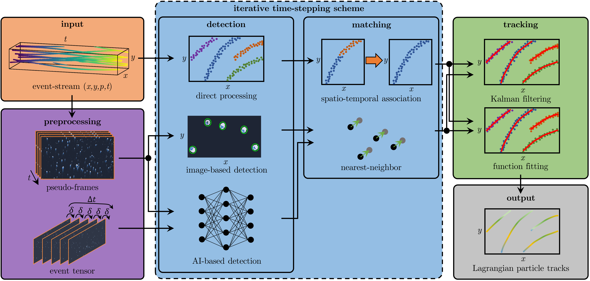
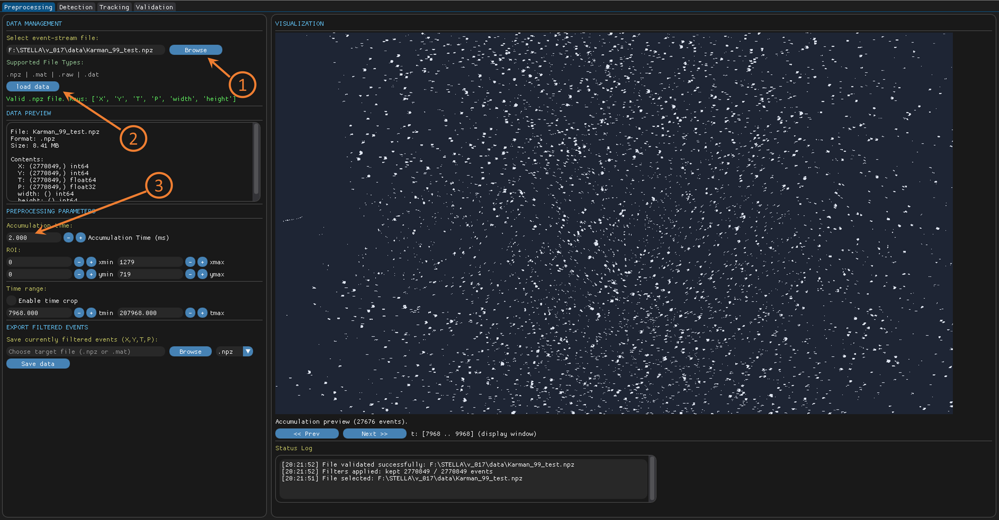
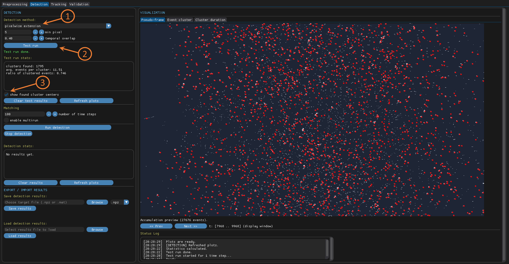
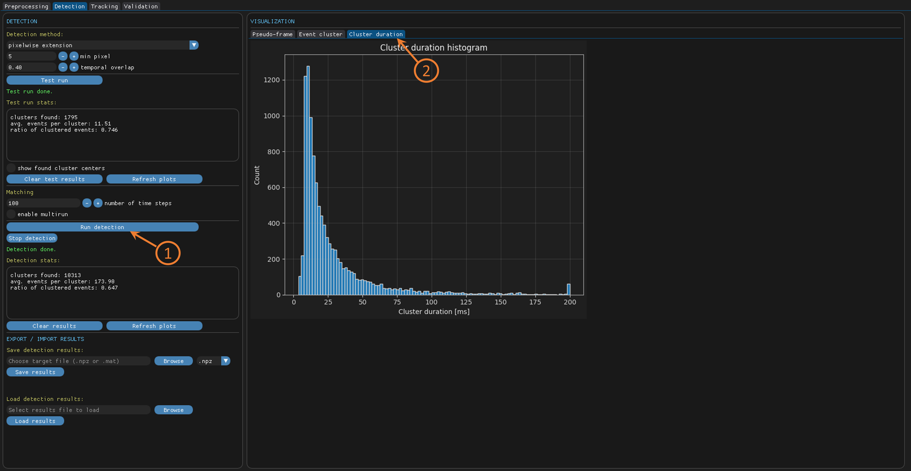
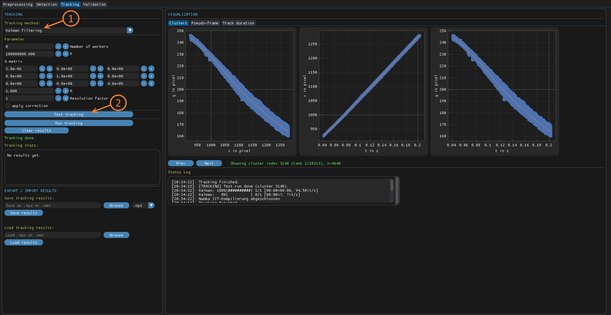
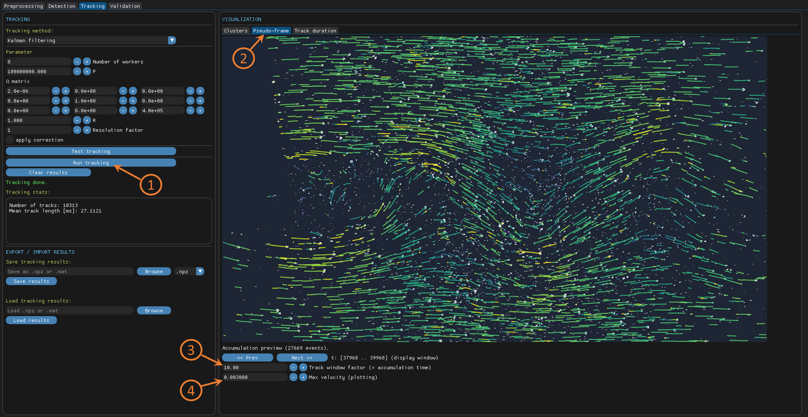
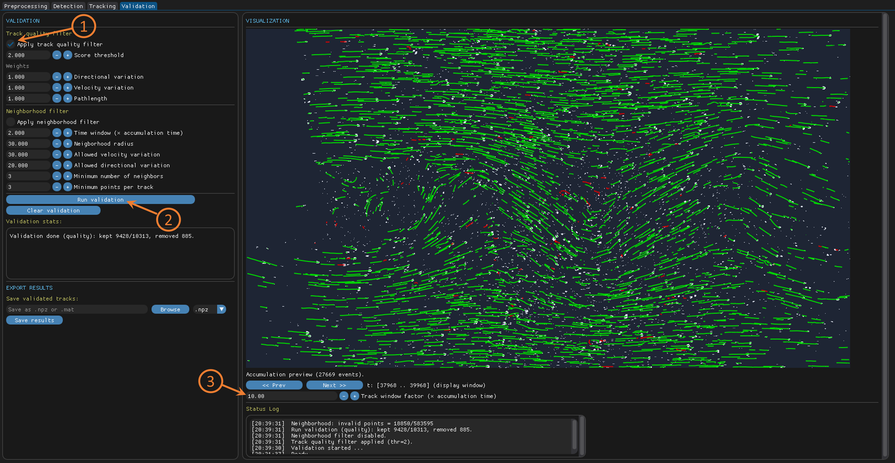

# STELLA - a modular framework for StatioTemporal Event-based Lagrangian particLe trAcking
We introduce STELLA (v1.0.1), a modular framework for **s**tatio**t**emporal **e**vent-based **L**agrangian partic**l**e tr**a**cking in fluid flows. The framework is implemented as a GUI in python and takes the raw event stream obtained from an event-based camera as input. Once the data is loaded, the processing is done in four steps: Preprocessing, Detection, Tracking, Validation. In preprocessing, a ROI can be set in time and space and the filtered events can be saved. Subsequently, different algorithms for direct processing and image-based detection can be used to identify clustered events associated to individual particles. Based on the clustered events, particle tracks (position, velocity) can be derived by using a Kalman filter, spline fitting or hybrid approaches. Finally, a track quality filter and a neighborhood filter can be applied to reject spurious tracks during validation. In every step, the evaluation results can be saved and loaded in a way that also just single modules of STELLA can be used. For further information, please find our paper here: [STELLA](https://www.youtube.com/watch?v=dQw4w9WgXcQ).



If you use any of this code, please cite the following publication:
```bibtex
@article{Sachs2026STELLA,
  title={STELLA: A modular framework for SpatioTemporal Event-based Lagrangian particLe trAcking},
  author={Sachs, Sebastian and Jung, Steffen and Kahl, Max and Willert, Christian and Keuper, Margret and Cierpka, Christian},
  pages = {X},
  volume = {X},
  number = {X},
  journal = {Experiments in Fluids},
  year={2026}
}
```

# Install
install STELLA

```
git clone https://github.com/sesa1504/STELLA.git
cd STELLA
```

Create a new python environment using python 3.12.x:

```
conda create -y -n STELLA python=3.12.12 pip
conda activate STELLA
```

Install dependencies:

```
pip install --upgrade pip
pip install -r requirements.txt
```

Hint: STELLA is able to read .raw files. However, to reduce loading time, you can use the standalone code `utils/convert_to_npz.py` or `utils/convert_to_npz_pyebiv.py` to convert from .raw or .dat to .npz or .mat.
    
# Datasets
Under `datasets/` you will find synthetic and experimental data as test cases. These datasets are rather small and can be used to try out different functionalities of STELLA.

Larger datasets used as Benchmark and to train artificial neural networks can be found here upon final publication of our paper.

# Quick start guide
To start the GUI, run `python main.py`. Changes in the set parameters are confirmed by pressing the enter key. As a small tutorial, the processing of experimental data is exemplified below:

1) **Preprocessing**
- select `datasets/experimental.npz` as data file and click on `load data`
- set the accumulation time to 2 ms
      


2) **Detection**
- in the detection tab, select `pixelwise extension` as detection method
- using default settings, click on `Test run` to perform the detection on the first frame
- by activating `show found cluster centers`, the middle points of found clusters are marked in the pseudo-frame
      

- if the test run is successful, hit `Run detection` to perform the detection for 100 time steps
- the progress can be tracked in the status log at the lower right panel
- once detection is finished, statistics are shown on in the left panel und a histogram for cluster duration is given under `Cluster duration` in the right panel
  


3) **Tracking**
- in the tracking tab, select `Kalman filtering` as tracking method
- using default settings, click on `Test tracking` to perform tracking for one event cluster
- the found track for the selected cluster is displayed in the right panel
      

- if successful, click on `Run tracking` to perform the tracking for all event clusters
- by using the `Prev` and `Next` buttons, the calculated tracks for other event clusters can be seen
- for visualization in an overlay of the pseudo-frame, select the `Pseudo-frame` panel on the right, set the `Track window factor` to 10, the `Max velocity` to 0.003 and hit `Next >>` a few times
  

- in the `Track duration` panel on the right, a histogram on the track duration is displayed
    
4) **Validation**
- in the validation tab, select the `Apply track quality filter` checkbox and click on `Run validation`
- for visualization, set the `Track window facotr` to 10: valid and invalid tracks are displayed in green and red, respectively
      

- in the lower left panel, the validated tracks can be saved as .npz or .mat file
- for further post processing, see `plot_results.py` regarding handling of the output data
# Handling output
For further usage and plotting, the particle tracks saved in the validation step can be processed in python. An example data handling if provided in the standalone code `plot_results.py`.
